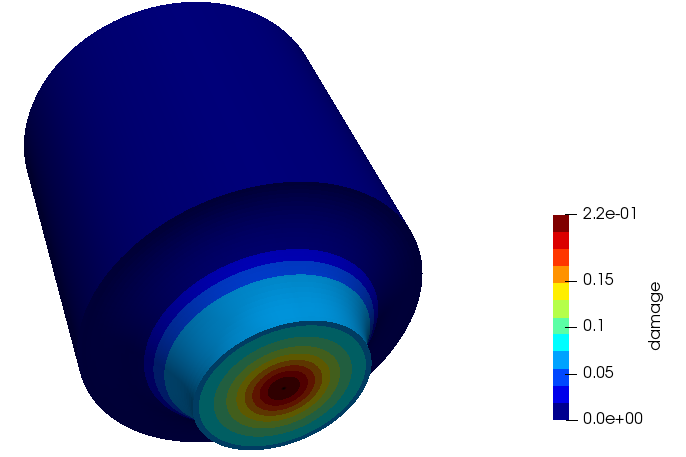
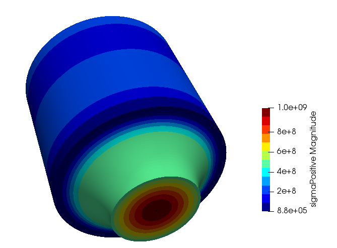

# Uncoupled damage application
An OpenFOAM based application for calculating uncoupled damage evolution and fields related to this. (Only compatible with the bekaert-v2.0 toolbox) 

## What is this application?

This is a post-processing application for OpenFOAM cases that calculates and writes out uncoupled damage fields. The following fields that may be relevant to damage evolution are calculated:

- The lode parameter
- The triaxiality
- The positive stress tensor
- The negative stress tensor
- The maximun principal stress

The application currently provides the Bai and Wierzbicki model (Doi - 10.1016/j.ijplas.2007.09.004) and an uncoupled version of the Lemaitre damage model with crack-closure effects (Teixeira. Ductile Damage Prediction in Sheet Metal Forming and Experimental Validation. PhD thesis). By default, the application is set to compile with the uncoupled Lemaitre damage model.

## Usage


### Compilation instructions

To compile, place the 'uncoupledDamage' directory in the `applications/utilities` directory of bekaert-v2.0 and run the  ./Allwmake script.

### To run

Enter the directory of a given case and run the command:
```
$ uncoupledDamage
```

By default, only the damage field is printed out. To print out all of the calculated fields (lode parameter, triaxiality, positive and negative stress tensors and max principal stress) run the command: 

```
$ uncoupledDamage -verbose
```

### How to customise

This application can be customised by the user by implementing their own damage law, adding it to the `damageLaws` directory, and changing the following line (where it appears) in uncoupledDamage.C:

```
#   include "damageLaws/uncoupledLemaitreCrackClosure/damageParameters.H"
```
to a user created law:

```
#   include "damageLaws/<user created law>/damageParameters.H"
```
and re-compiling.

## Example Results

Damage and positive stress tensor (magnitude) fields for a notched round bar case:
<p float="left">
   
   
</p>

